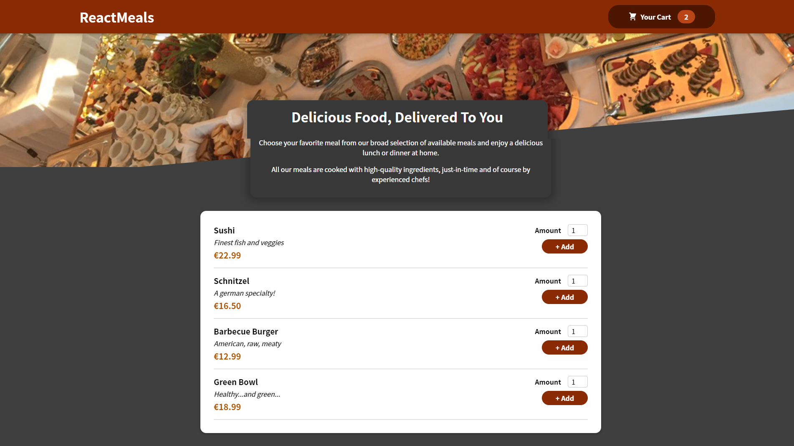

# React Meals

Frontend UI for a Meal Order Application in React 17

# Table of Contents

- [React Meals](#react-meals)
- [Table of Contents](#table-of-contents)
- [Application Images](#application-images)
- [Instructions](#instructions)
- [Packages](#packages)

# Application Images

<p align="center" >
 
</p>

# Instructions

- Clone repo
- Install dependencies by running `npm install`
- Run `npm start` to run the application in development mode

# Packages

```
├── @testing-library/jest-dom@5.16.4
├── @testing-library/react@11.2.7
├── @testing-library/user-event@12.8.3
├── bindings@1.5.0
├── file-uri-to-path@1.0.0
├── nan@2.16.0
├── react-dom@17.0.2
├── react-scripts@4.0.1
├── react@17.0.2
└── web-vitals@0.2.4
```
